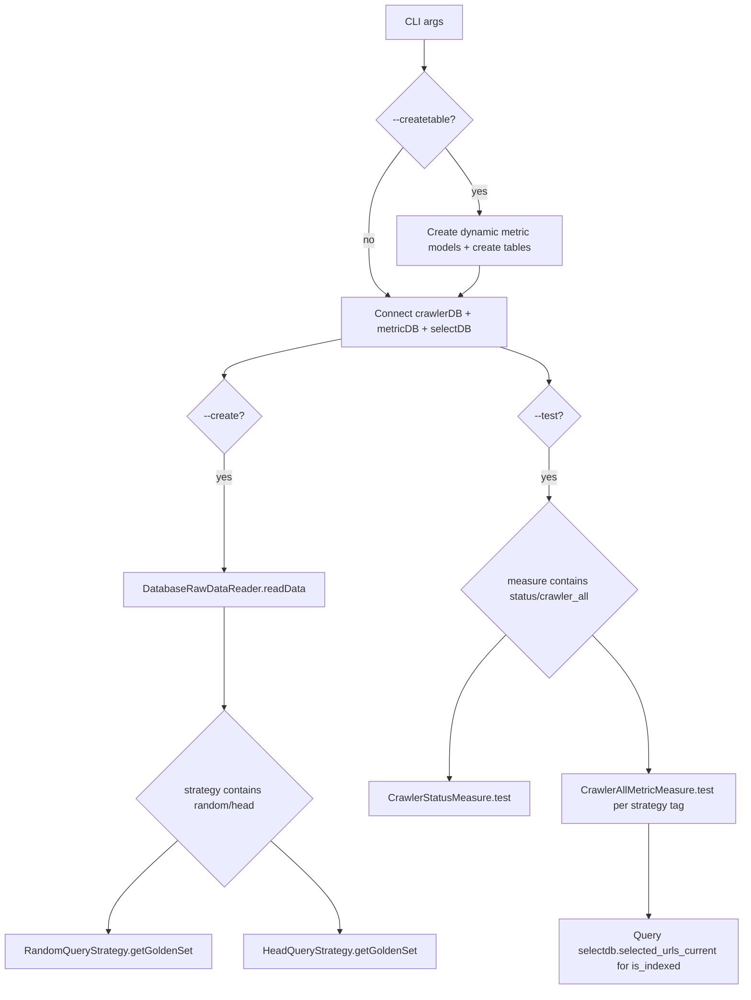

# measure.py - Full Technical Document

## 1. Scope and Role

`measure.py` is the main orchestrator for:

- Creating metric tables.
- Generating golden datasets from trending keyword sources.
- Executing measurement jobs (crawler status and coverage metrics).

It coordinates three layers:

- Data source ingestion (`Metric.RawDataReader`).
- Golden set generation (`Metric.Query`).
- Metric computation and persistence (`Metric.Measure`).

## 2. CLI Contract

`measure.py` exposes the following arguments:

- `--strategy [random|head]...`: Which golden-set strategy(ies) to run.
- `--crawler_db_url`: Host:port for crawler PostgreSQL.
- `--metric_db_url`: Host:port for metric PostgreSQL.
- `--select_db_url`: Host:port for selectdb PostgreSQL (required for `crawler_all` index coverage).
- `--create`: Build/update golden sets.
- `--rawdatareader db`: Read trending raw data via DB-backed reader.
- `--update <days>`: Raw-data cache TTL in days (default: 14).
- `--keywordNums <N>`: Number of keywords for strategy (default: 100).
- `--test`: Execute measure phase.
- `--typesense_url`: Reserved/not actively used by current active measures.
- `--measure [status|rank|crawler_all|all]...`: Which measure(s) to execute.
- `--batch_id <id>`: `crawler_all` measures this batch instead of the latest one.
- `--batch_age_days <N>...`: `crawler_all` measures every batch created exactly N days ago (used by the daily re-measure cron with `7 14 27`).
- `--createtable`: Create metric tables and upgrade existing ones (see 3.1) before execution.

## 3. Runtime Modes

### 3.1 Table creation mode

- If `--createtable` is set:
  - Calls `createAllMetricModel()` to register dynamic ORM models:
    - `crawler_stat_total`, `crawler_stat_a`, `crawler_stat_b`
    - `metric_headset_total`, `metric_headset_a`, `metric_headset_b`
    - `metric_randomset_total`, `metric_randomset_a`, `metric_randomset_b`
  - Calls `createDB(..., createTable=True, base=MetricBase)` for metric DB.
  - Calls `Database/migrations.py:migrate_metric_db()`. `create_all` never alters an existing table, so this adds the new columns to existing tables: `batch_id` / `measured_at` / `batch_age_days` / `is_recheck` on the six coverage tables (primary key becomes `(batch_id, stat_date)`, old rows get the latest batch created on or before their `stat_date`), and the `url_canonical` + crawler-detail columns on `metric_url`. The data changes run only on the first upgrade, detected per coverage table by `batch_id` being added in this run: never-measured zeros become NULL (`indexed_*` before selectdb was wired in, all `ranked_*`, `crawler_stat_*.indexed`), and rows written before the upgrade (`measured_at IS NULL`) get `is_recheck` by the rule in 3.3, per table and per `batch_id`: the row with the earliest `stat_date` among those with `batch_age_days <= 2` is the initial measurement (`false`), every other row is a re-measurement (`true`, including rows whose `batch_age_days` is NULL). It prints the counts per table. Later runs only check the schema, so labels fixed by hand after the upgrade (see [06-rollout-checklist.md](./06-rollout-checklist.md)) are not overwritten. Safe to re-run; the container runs it on every start (`entrypoint.sh`) and exits without starting cron if it fails.

### 3.2 Dataset creation mode (`--create`)

Flow:

1. Build `DatabaseRawDataReader(metricDB, modelFactory, update_day)`.
2. `readData()` returns trending keywords:
   - Uses latest cached `metric_batches` entry if fresh.
   - Otherwise fetches from SerpApi and persists new batch/query rows.
3. Read latest batch id via `get_latest_batch_id()`.
4. For each strategy tag, count the batch's queries that carry the tag and have at least one `metric_url` row:
   - At least `keywordNums` (or every keyword, if the batch has fewer): the tag's golden set is complete. Print that it is skipped; SerpApi is not called.
   - Otherwise fill it up: tagged queries without URLs are queried again; if fewer than `keywordNums` queries carry the tag, pick new keywords without the tag:
     - `random`: sample from the keywords without the `random` tag.
     - `head`: go down the frequency order, skipping keywords that already carry `head`.
   - Print how many queries were re-queried and how many keywords were added.
5. For each picked keyword:
   - Add the strategy tag to `metric_queries.tags`.
   - If the query already has `metric_url` rows (another tag picked it), keep them; SerpApi is not called.
   - Otherwise query Google organic results via SerpApi and insert the rows into `metric_url`.
   - Existing `metric_url` rows are never deleted, so a rerun of `--create` on the same batch keeps their ids, the per-URL results written by the initial measurement, and the `metric_url_recheck` rows that reference them.
   - A query for which SerpApi returned 0 results has no `metric_url` rows, so it is queried again on every `--create` run of that batch.
6. Recompute batch metadata (`meta_total_queries`, `meta_total_urls`, `meta_tag_stats`), also when the tag was skipped.
7. Check the golden set (`check_golden_set`): for each selected tag, count the `metric_url` rows of that tag in the batch. If it is 0 or below `--keywordNums × 3` (a query returns at most 10 URLs, so fewer means most queries failed), print the tag, the count and the minimum, and exit with code 1 without running `--test`.

Failure handling (golden sets used to fail silently, see [05 §7](./05-metric-pipeline-and-queries.md#7-known-data-gaps)):

- If Google Trends returns 0 keywords for every country, no batch is created and `measure.py` exits with code 1. The last SerpApi error of each country is printed. Before this check an empty batch (no queries, no URLs) was created; batches 10–17 came from this.
- When a keyword search still fails after its retries, `QueryStrategy.getQuery` prints the last SerpApi error and returns no URLs for that keyword; step 7 catches the case where most keywords failed.

### 3.3 Measure execution mode (`--test`)

- `status`: runs `CrawlerStatusMeasure`.
- `status`: `indexed` on `crawler_stat_total` is `count(*)` of `selectdb.selected_urls_current` (needs `--select_db_url`; NULL otherwise, and a failed count keeps the value measured earlier that day). Team A/B tables have no selectdb split, so their `indexed` is NULL.
- `crawler_all`: for each batch (latest, `--batch_id`, or `--batch_age_days`) and each selected strategy tag (`head`/`random`), runs `CrawlerAllMetricMeasure`.
  - Golden URLs are passed through w3lib `canonicalize_url` (the spider's key) before matching; the raw spelling is looked up too, for rows injected before `golden_inject` canonicalized.
  - Queries `selectdb.selected_urls_current`; a golden URL is `is_indexed` when it is in that list and crawled (`last_fetch_ok IS NOT NULL`, the same check as `is_crawled`). It prints how many URLs of the tag are in the list but not crawled.
  - Without `--select_db_url`, if selectdb fails, or if `selected_urls_current` is empty, `indexed_num` / `indexed_rate` are written as NULL (not measured) and the other columns are still written.
  - `CrawlerAllMetricMeasure` decides `is_recheck` itself, not from `--create`. For one batch and one tag, the first measurement within 2 days of the batch's creation (`batch_age_days <= 2`) is the initial measurement (`is_recheck = false`); every other measurement is a re-measurement. Before writing, it looks for this batch's `is_recheck = false` row in the tag's `_total` table:
    - none, and `batch_age_days <= 2`: initial measurement;
    - one exists and its `stat_date` is today (a same-day rerun): still the initial measurement, and it overwrites that row;
    - otherwise: re-measurement (for example day 7, or a first measurement on day 3).

    The initial measurement updates the per-URL labels in `metric_url`; a re-measurement puts them in `metric_url_recheck` and leaves `metric_url` as it was. The 2-day window lets a failed first-day run be redone the next day.
  - If a `url_state_current_*` shard cannot be scanned, the failed shards are rescanned up to 3 more times, 30 seconds apart, each time on a new connection (the failed connection is discarded; large shards such as 056 have hit TCP timeouts). If a shard still fails, the measurement stops without writing coverage, rather than writing an undercount, and prints the shard numbers.
  - If the batch has no golden URL for the tag, the measurement prints an error saying the golden set of this batch was not collected, instead of silently returning.
  - A failed measurement (no golden URL, or shards that keep failing) does not stop the others: `measure.py` measures every remaining batch and tag, then exits with code 1.
- `rank`: currently no-op in active implementation.

## 4. DB Initialization

`createDB(user, password, url, name)` composes:

- `postgresql+psycopg2://{user}:{password}@{url}/{name}`

Effective defaults from `measure.py`:

- Crawler DB credentials: `crawler:crawler`, DB name `crawlerdb`.
- Metric DB credentials: `metric:metric`, DB name `metricdb`.
- Select DB credentials: `select:select`, DB name `selectdb`.

## 5. Key Internal Functions

### 5.1 `get_latest_batch_id`

- SQLAlchemy `select(MetricBatch.id).order_by(id desc).limit(1)`.
- Returns latest batch id or `None`.
- Used by dataset generation and coverage measuring.

### 5.2 `createDataset`

Responsibilities:

- Read or refresh raw trending keyword data.
- Run one or more golden-set strategies.
- Persist/refresh query->URL mapping in metric DB.
- Return the batch id, which `check_golden_set` then checks (3.2 step 7).

### 5.3 `test`

Responsibilities:

- Run measurement classes against crawler + metric + select DBs.
- Persist computed KPI tables via UPSERT.

## 6. Control Flow Diagram

## 7. Operational Notes

- `rank` pathway is not active; `ranked_num` / `ranked_rate` are written as NULL.
- `indexed` is populated from `selectdb.selected_urls_current` when `--select_db_url` is provided.
- `indexed` means "selected by IndexSelection and crawled". IndexSelection's list does not require the page to have been fetched, so a selected but uncrawled URL is not counted; IndexCov never exceeds CrawlCov. The printed "in selected_urls_current but not crawled" count shows how many were left out.
- `--measure all` appears in choices but no explicit branch handles it in current code.

