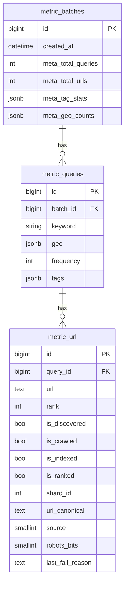

# Database Schema Design - Full Technical Document

## 1. Schema Domains

The system uses two logical data domains:

- Crawler domain (`crawlerdb`): crawl state and daily crawl summaries.
- Metric domain (`metricdb`): golden datasets, URL-level labels, and KPI rollups.

## 2. Crawler Domain Tables (Read by Metrics)

### 2.1 `url_state_current_###` (dynamic shard tables, 256 shards)

Generated via `UrlStateCurrentMixin` + suffix `000..255`.

Core columns used by measurement:

- `url` (PK). Always the w3lib `canonicalize_url` spelling for rows written by the crawler, so golden URLs are canonicalized before matching.
- `domain_id`
- `last_fetch_ok` (nullable timestamp; non-null => crawled)

Copied into `metric_url` for failure analysis (not used in the rates): `first_seen`, `last_scheduled`, `source` (0 natural, 1 golden_inject, 2 wiki pageview, 3 golden parent patrol), `robots_bits` (0 unknown, 1 allowed, 2 disallowed), `last_fail_reason`, `num_scheduled_90d`, `num_fetch_fail_90d`.

### 2.2 `domain_state`

- `domain_id` (PK)
- `domain` (unique)
- `shard_id`
- `domain_score`

Used to map domain -> shard/team when URL is not directly found. `domain` is the eTLD+1 for ordinary hosts and the full host for subdomains whitelisted in `shard_split_subdomain`, so the lookup tries the URL's host first and then its eTLD+1.

### 2.3 `summary_daily`

- `event_date` (PK)
- `num_fetch_ok`
- `num_fetch_fail`
- `fail_reasons` JSONB
- additional error counters

Used by `CrawlerStatusMeasure` for daily/7-day/30-day flow KPIs.

## 3. Metric Domain Core Tables

### 3.1 `metric_batches`

- `id` (PK)
- `created_at`
- `meta_total_queries`
- `meta_total_urls`
- `meta_tag_stats` JSONB
- `meta_geo_counts` JSONB

Represents one raw-trending ingestion batch and its derived metadata.

### 3.2 `metric_queries`

- `id` (PK)
- `batch_id` (FK -> `metric_batches.id`)
- `keyword`
- `geo` JSONB array
- `frequency`
- `tags` JSONB array
- GIN index on `tags` (`ix_metric_queries_tags`)

Represents keyword-level dataset units.

### 3.3 `metric_url`

- `id` (PK)
- `query_id` (FK -> `metric_queries.id`)
- `url`
- `rank`
- `is_discovered`
- `is_crawled`
- `is_indexed`
- `is_ranked`
- `shard_id`
- `url_canonical`: `canonicalize_url(url)`, the spelling used to match crawlerdb/selectdb
- `first_seen`, `last_scheduled`, `source`, `robots_bits`, `last_fail_reason`, `num_scheduled_90d`, `num_fetch_fail_90d`: copied from the matching `url_state_current` row at the latest measurement (NULL if not discovered)

Represents URL-level golden entries and measurement labels. The `is_*` labels and the crawler-detail columns are written only by the measurement taken when the golden set is built (t0); re-measurements do not overwrite them (they only fill `url_canonical`).

`is_indexed` is NULL when selectdb was not measured.

### 3.4 `metric_url_recheck`

Per-URL results of re-measurements (`--batch_id`, `--batch_age_days`, or `--test` without `--create`).

- `metric_url_id` (FK -> `metric_url.id`), `stat_date`: PK
- `batch_age_days`, `measured_at`
- `is_discovered`, `is_crawled`, `is_indexed`, `shard_id`
- `first_seen`, `last_scheduled`, `source`, `robots_bits`, `last_fail_reason`, `num_scheduled_90d`, `num_fetch_fail_90d`

With the daily cron, each golden URL has its t0 state in `metric_url` and its day 7 / 14 / 27 states here.

## 4. Metric Rollup Tables (Dynamic)

### 4.1 Crawler status rollups

- `crawler_stat_total`
- `crawler_stat_a`
- `crawler_stat_b`

Shared schema from `CrawlerStatMixin`:

- snapshot: `discovered`, `crawled`, `indexed` (`indexed` = rows in `selectdb.selected_urls_current`, Total only; NULL when not measured)
- daily flow: `fetch_ok`, `fetch_fail`, `fetch_total`
- rolling windows: `*_7`, `*_30`
- HTTP errors: 404 and 500 for 1/7/30 day windows

PK: `stat_date`.

### 4.2 Coverage rollups

- `metric_headset_total|a|b`
- `metric_randomset_total|a|b`

Shared schema from `MetricCoverageMixin`:

- `total`
- `discovered_num`, `discovered_rate`
- `crawled_num`, `crawled_rate`
- `batch_id`: the `metric_batches.id` that was measured
- `measured_at`: timestamp of the measurement (NULL on rows written before this column existed)
- `batch_age_days`: `stat_date` minus the batch's creation date
- `is_recheck`: false for the measurement taken right after the golden set was built (`--create --test`), true for later re-measurements
- `indexed_num`, `indexed_rate` (NULL when selectdb was not measured)
- `ranked_num`, `ranked_rate` (not implemented; NULL)

PK: `(batch_id, stat_date)`. Several batches can be measured on the same day, and the same batch on several days.

## 5. Team Partition Definition

- Team A: shard id `0..127`
- Team B: shard id `128..255`

This partition is used in both status and coverage aggregations.

## 6. ER Diagram (Metric Domain)

