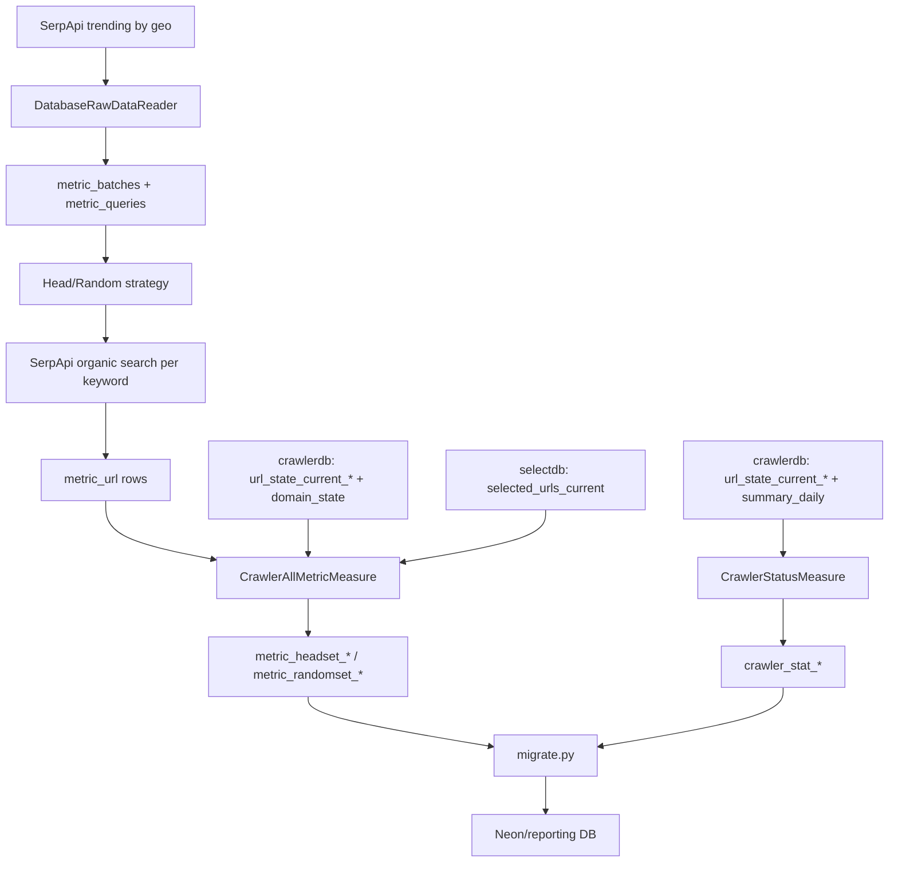

# Metric Pipeline, Query Logic, and URL Sources - Full Technical Document

## 1. End-to-End Data Flow



## 2. Architecture Design

### 2.1 Layered components

- Orchestration layer: `measure.py`, `migrate.py`, cron schedules.
- Data access layer: `Database.Database`, SQLAlchemy ORM models.
- Data ingestion layer: `DatabaseRawDataReader` (cache + API fallback).
- Dataset generation layer: `HeadQueryStrategy`, `RandomQueryStrategy`.
- Measurement layer: `CrawlerStatusMeasure`, `CrawlerAllMetricMeasure`.
- Reporting export layer: pandas-based table replication (`migrate.py`).

### 2.2 Reliability characteristics

- Session context manager with rollback on exceptions.
- Per-keyword commit in strategy generation (limits transaction blast radius).
- Per-table isolation in migration loop.
- API retry logic with exponential backoff in keyword search; the last SerpApi error is printed when a keyword or a country is given up.
- Golden-set collection fails loudly: no batch is created when Google Trends returns 0 keywords, and `--create` exits with code 1 (skipping `--test`) when a tag collected fewer than `--keywordNums × 3` URLs.
- Failed `url_state_current` shards are rescanned up to 3 times, 30 seconds apart, on new connections.

## 3. Metric Query Logic (SQL-equivalent)

Below are representative SQL equivalents of ORM operations.

### 3.1 Latest batch lookup

```sql
SELECT id
FROM metric_batches
ORDER BY id DESC
LIMIT 1;
```

### 3.2 Cached batch retrieval (raw data reuse)

```sql
SELECT *
FROM metric_batches
ORDER BY created_at DESC
LIMIT 1;
```

If batch age < `update_day`, load:

```sql
SELECT keyword, frequency, geo
FROM metric_queries
WHERE batch_id = :batch_id;
```

### 3.3 Golden URL retrieval by strategy tag

```sql
SELECT mu.*
FROM metric_url mu
JOIN metric_queries mq ON mq.id = mu.query_id
WHERE mq.batch_id = :batch_id
  AND mq.tags @> '["head"]'::jsonb; -- or random
```

### 3.4 Batch metadata recomputation

```sql
SELECT COUNT(*)
FROM metric_queries
WHERE batch_id = :batch_id;

SELECT COUNT(*)
FROM metric_url mu
JOIN metric_queries mq ON mq.id = mu.query_id
WHERE mq.batch_id = :batch_id;
```

### 3.4a Golden URL matching

`metric_url.url` is the raw SerpApi `link`. The crawler stores every URL as
w3lib `canonicalize_url(...)` (query keys sorted, percent-escapes upper-cased,
non-ASCII percent-encoded, fragment dropped, empty path -> `/`), and
`url_state_current` / `selected_urls_current` are keyed by that string. So each
golden URL is canonicalized first; raw spellings that canonicalize to the same
string count as one URL. Both spellings are looked up, because
`golden_inject` inserted raw strings before it canonicalized them.

For every shard `url_state_current_000..255`:

```sql
SELECT url, last_fetch_ok IS NOT NULL AS crawled, first_seen, last_scheduled,
       source, robots_bits, last_fail_reason, num_scheduled_90d, num_fetch_fail_90d
FROM url_state_current_###
WHERE url IN (:canonical_and_raw_urls);
```

- discovered: at least one row in any shard.
- crawled: at least one of those rows has `last_fetch_ok` (OR across shards and spellings; a later non-crawled row never overrides an earlier crawled one).
- shard / team: the crawled row's shard, else the first row found; if no row, `domain_state` by the URL's host, then by its eTLD+1.
- A shard that fails is rescanned up to 3 more times, 30 seconds apart, on a new connection; merging is an OR / earliest-timestamp, so rows seen twice are not double-counted. If a shard still cannot be read, the run stops without writing coverage and prints the shard numbers.

### 3.5 Status snapshot per shard

For each `url_state_current_###` table:

```sql
SELECT
  COUNT(*) AS discovered,
  COUNT(*) FILTER (WHERE last_fetch_ok IS NOT NULL) AS crawled
FROM url_state_current_###;
```

### 3.6 Daily + rolling flow from `summary_daily`

For date range `[today-29, today]`, compute in application loop:

- daily (`delta=0`): `fetch_ok`, `fetch_fail`, `fetch_total`
- 7-day (`delta<7`): sums of fetch and HTTP 404/500
- 30-day (`delta<30`): sums of fetch and HTTP 404/500

### 3.6a Index status lookup from selectdb

During `CrawlerAllMetricMeasure`, each golden URL's `is_indexed` is determined by checking `selectdb`:

```sql
SELECT url
FROM public.selected_urls_current
WHERE url = ANY(:golden_urls);
```

URLs found in the result set are in the candidate list. This query is batched in chunks of 10,000 URLs and uses the same canonical + raw spellings as 3.4a.

Definition: a golden URL is indexed when, at measurement time, it is in `selectdb.selected_urls_current` **and** it has been crawled. Crawled is the same check as `is_crawled` / CrawlCov (3.4a): some `url_state_current` row for the URL has `last_fetch_ok IS NOT NULL`. `selected_urls_current` is IndexSelection's candidate list; the v1 pipeline (upstream WebSearchEngine PR #4) selects a URL once its `first_seen` is before the cutoff, without requiring it to have been fetched. A selected URL that has not been crawled is therefore not counted, so `is_indexed` implies `is_crawled` and `indexed_num <= crawled_num` in every coverage row. The measurement prints how many golden URLs of the tag are in the list but not crawled:

```
   Tag 'head': N URL(s) in selected_urls_current but not crawled (not counted as indexed)
```

`is_indexed` and `indexed_*` are written as NULL (not measured) when:

- selectdb is not configured, or the query fails;
- `selected_urls_current` has no rows. Before the lookup the measurement runs

  ```sql
  SELECT NOT EXISTS (SELECT 1 FROM public.selected_urls_current);
  ```

  and, if it is true, prints `selected_urls_current 是空的，indexed 記為 NULL`. An empty candidate list (for example after a reset, or a failed refresh) says nothing about whether a golden URL would be selected, so it is not counted as 0, even for crawled URLs. The other columns (`total`, `discovered_*`, `crawled_*`) are written as usual.

The hourly status count (`crawler_stat_total.indexed`, see [01-measure-py.md](./01-measure-py.md)) is not affected: an empty list is written as 0, which is the real row count.

#### Historical data

Coverage rows in the production metricdb written before this definition used two older rules. Commits are from upstream `main`.

**Before 2026-06-03: indexed was not measured.** The code did not query selectdb and hard-coded `indexed` to `False` for every URL (`ccd935b`, `Metric/Measure/CrawlerAllMetricMeasure.py` lines 81-83), so every `indexed_num` from April and May is 0. The upgrade's automatic cleanup (`Database/migrations.py:_clear_unmeasured_values`, see [06-rollout-checklist.md](./06-rollout-checklist.md)) sets `indexed_num` / `indexed_rate` to NULL on these rows. Six of them have a non-zero `indexed_rate` next to `indexed_num = 0`. The code at that time could not have written these values (its rate is `indexed_num / total`, which is 0); where they came from is unknown. The cleanup clears them too. Original values:

| Table | stat_date | total | indexed_num | indexed_rate |
|-------|-----------|------:|------------:|-------------:|
| `metric_headset_total` | 2026-04-01 | 7245 | 0 | 0.184 |
| `metric_headset_total` | 2026-04-16 | 7439 | 0 | 0.185 |
| `metric_headset_total` | 2026-05-03 | 7329 | 0 | 0.164 |
| `metric_randomset_total` | 2026-04-01 | 7968 | 0 | 0.181 |
| `metric_randomset_total` | 2026-04-17 | 7958 | 0 | 0.228 |
| `metric_randomset_total` | 2026-05-02 | 7934 | 0 | 0.232 |

**From 2026-06-05: indexed meant "in the list" only.** PR #3 (`e04dbf7`, merged 2026-06-05) marked every golden URL found in `selected_urls_current` as indexed, whether or not it had been crawled (`Metric/Measure/CrawlerAllMetricMeasure.py:203-209`), and counted that flag directly (`:230`). The 2026-06-05 and 2026-06-12 rows were computed this way and are not comparable with rows written under the current definition. They cannot be recomputed: the production metricdb keeps no per-URL result per measurement date (`metric_url` has no date column and was overwritten by every later measurement). Both the automatic cleanup (`stat_date` before 2026-06-05) and the manual fix in [06-rollout-checklist.md](./06-rollout-checklist.md) (`stat_date >= '2026-09-17'`) leave these rows unchanged. Original values (2026-06-12 has no head rows: batch 9's head golden set was not collected, see §7):

| Table | stat_date | total | crawled_num | indexed_num | indexed_rate |
|-------|-----------|------:|------------:|------------:|-------------:|
| `metric_headset_total` | 2026-06-05 | 7339 | 2127 | 1509 | 0.2056 |
| `metric_headset_a` | 2026-06-05 | 3815 | 1120 | 710 | 0.1861 |
| `metric_headset_b` | 2026-06-05 | 3483 | 1007 | 799 | 0.2294 |
| `metric_randomset_total` | 2026-06-05 | 7945 | 2208 | 1449 | 0.1824 |
| `metric_randomset_a` | 2026-06-05 | 4073 | 1176 | 643 | 0.1579 |
| `metric_randomset_b` | 2026-06-05 | 3782 | 1032 | 806 | 0.2131 |
| `metric_randomset_total` | 2026-06-12 | 7738 | 1926 | 1260 | 0.1628 |
| `metric_randomset_a` | 2026-06-12 | 3916 | 1036 | 578 | 0.1476 |
| `metric_randomset_b` | 2026-06-12 | 3560 | 890 | 682 | 0.1916 |

### 3.7 Coverage formulas

For each group `G in {Total, A, B}`:

- `total_G = count(distinct canonical url in group)`
- `discovered_rate_G = discovered_num_G / total_G`
- `crawled_rate_G = crawled_num_G / total_G`
- `indexed_rate_G = indexed_num_G / total_G`

`ranked_*` is not implemented and written as NULL. `indexed_*` is NULL when not measured.

Each coverage row also records `batch_id`, `measured_at`, `batch_age_days` and
`is_recheck` (false only for the initial measurement: per batch and tag, the
first measurement within 2 days of creation). The daily cron re-measures each
batch at 7, 14 and 27 days, so the gap between the initial measurement and the
day-27 row shows how much the crawler discovered on its own after the queries
trended, before `golden_inject` force-injects the batch at 4 weeks.
After injection, discovered rates of that batch are close to 100% by
construction; `source` / `first_seen` separate injected from naturally
discovered rows.

Per-URL state: `metric_url` holds the initial measurement, `metric_url_recheck` holds each
re-measurement (keyed by `metric_url_id, stat_date`). Example, why golden URLs
were still undiscovered or uncrawled 27 days after the batch was built:

```sql
SELECT CASE
         WHEN NOT r.is_discovered THEN 'not discovered'
         WHEN r.robots_bits = 2 THEN 'robots.txt'
         WHEN r.last_fail_reason = 'HttpError 403' THEN '403'
         WHEN r.num_scheduled_90d > 0 AND r.num_fetch_fail_90d = 0 THEN 'scheduled, no result on this row'
         WHEN r.num_scheduled_90d = 0 THEN 'never scheduled'
         ELSE coalesce(r.last_fail_reason, 'other')
       END AS reason,
       count(*)
FROM metric_url_recheck r
JOIN metric_url u ON u.id = r.metric_url_id
JOIN metric_queries q ON q.id = u.query_id
WHERE q.batch_id = :batch_id AND r.batch_age_days = 27 AND NOT r.is_crawled
GROUP BY 1 ORDER BY 2 DESC;
```

## 4. UPSERT Write Patterns

Status tables upsert on `stat_date`; coverage tables upsert on `(batch_id, stat_date)`:

```sql
INSERT INTO metric_headset_total (batch_id, stat_date, ...)
VALUES (:batch_id, :stat_date, ...)
ON CONFLICT (batch_id, stat_date)
DO UPDATE SET ...;
```

This keeps same-day reruns idempotent while letting different batches (or the
same batch on different days) have their own rows. On the status tables,
`indexed` keeps the value already stored for the day when the new count is NULL.

## 5. URL Sources and External Endpoints

### 5.1 SerpApi endpoints

- Trending source (`DatabaseRawDataReader._fetch_trending_now`):
  - Engine: `google_trends_trending_now`
  - Parameters include `geo`, `hours=168`, `api_key`.

- Organic results (`QueryStrategy.getQuery`):
  - Engine: `google`
  - Parameters include `q`, `num`, `api_key`.

- Quota endpoint (`Metric/getQuota.py`):
  - `https://serpapi.com/account.json`

### 5.2 Internal database URLs

- Metric DB URL template:
  - `postgresql+psycopg2://metric:metric@<metric_db_url>/metricdb`
- Crawler DB URL template:
  - `postgresql+psycopg2://crawler:crawler@<crawler_db_url>/crawlerdb`
- Select DB URL template:
  - `postgresql+psycopg2://select:select@<select_db_url>/selectdb`

Cron defaults in Dockerfile currently use:

- `--metric_db_url 172.16.191.1:5433`
- `--crawler_db_url 172.16.191.1:5432`
- `--select_db_url 172.16.191.1:5444`

### 5.3 Migration target URL

`migrate.py` writes to Neon PostgreSQL URL with SSL requirement.

## 6. Important Current Limitations

- `SearchEngineAllMetricMeasure` and `TypesenseRankMeasure` are stubs in active code.
- `--measure all` has no explicit branch in `measure.py`.

## 7. Known Data Gaps

Some batches have no golden set. The cause is not confirmed; SerpApi running out
of quota is suspected. At the time the code did not report either failure.

| Batch | Created | What is missing | How it happened |
|-------|---------|-----------------|-----------------|
| 9 | 2026-06-12 | head: 1,000 queries, 0 URLs (random is complete: 7,179 URLs) | every organic search for head failed; `getQuery` returned no URLs |
| 10–17 | 2026-06-19 to 2026-08-07 | no queries, no URLs (empty batches) | Google Trends returned 0 keywords, and the batch was created anyway |

Measuring these batches now fails with "No golden URLs ... golden set of this
batch was not collected" instead of returning silently. The empty batches also
matter outside this repo: the crawler's golden domain tiering counted them as
batches. The checks in [01 §3.2](./01-measure-py.md#32-dataset-creation-mode---create)
stop both cases at `--create` time.

