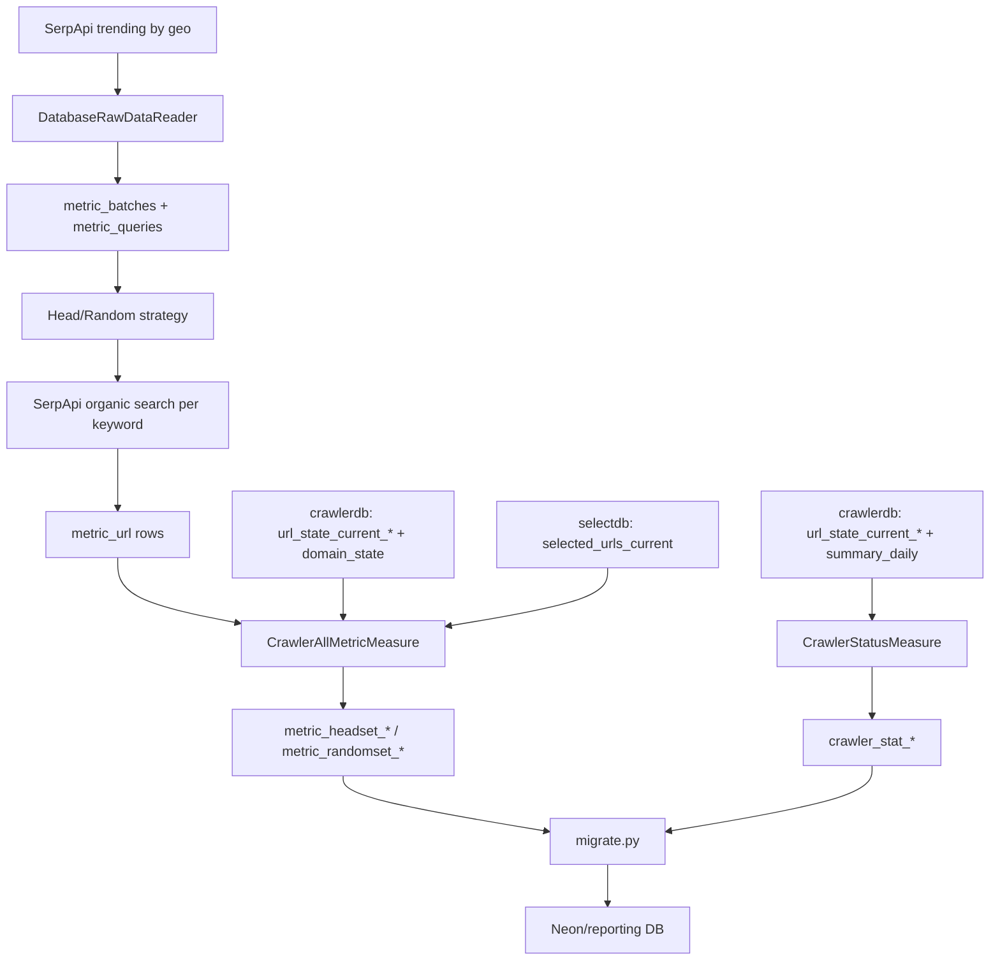

# Metric Pipeline, Query Logic, and URL Sources - Full Technical Document

## 1. End-to-End Data Flow



## 2. Architecture Design

### 2.1 Layered components

- Orchestration layer: `measure.py`, `migrate.py`, cron schedules.
- Data access layer: `Database.Database`, SQLAlchemy ORM models.
- Data ingestion layer: `DatabaseRawDataReader` (cache + API fallback).
- Dataset generation layer: `HeadQueryStrategy`, `RandomQueryStrategy`.
- Measurement layer: `CrawlerStatusMeasure`, `CrawlerAllMetricMeasure`.
- Reporting export layer: pandas-based table replication (`migrate.py`).

### 2.2 Reliability characteristics

- Session context manager with rollback on exceptions.
- Per-keyword commit in strategy generation (limits transaction blast radius).
- Per-table isolation in migration loop.
- API retry logic with exponential backoff in keyword search.

## 3. Metric Query Logic (SQL-equivalent)

Below are representative SQL equivalents of ORM operations.

### 3.1 Latest batch lookup

```sql
SELECT id
FROM metric_batches
ORDER BY id DESC
LIMIT 1;
```

### 3.2 Cached batch retrieval (raw data reuse)

```sql
SELECT *
FROM metric_batches
ORDER BY created_at DESC
LIMIT 1;
```

If batch age < `update_day`, load:

```sql
SELECT keyword, frequency, geo
FROM metric_queries
WHERE batch_id = :batch_id;
```

### 3.3 Golden URL retrieval by strategy tag

```sql
SELECT mu.*
FROM metric_url mu
JOIN metric_queries mq ON mq.id = mu.query_id
WHERE mq.batch_id = :batch_id
  AND mq.tags @> '["head"]'::jsonb; -- or random
```

### 3.4 Batch metadata recomputation

```sql
SELECT COUNT(*)
FROM metric_queries
WHERE batch_id = :batch_id;

SELECT COUNT(*)
FROM metric_url mu
JOIN metric_queries mq ON mq.id = mu.query_id
WHERE mq.batch_id = :batch_id;
```

### 3.4a Golden URL matching

`metric_url.url` is the raw SerpApi `link`. The crawler stores every URL as
w3lib `canonicalize_url(...)` (query keys sorted, percent-escapes upper-cased,
non-ASCII percent-encoded, fragment dropped, empty path -> `/`), and
`url_state_current` / `selected_urls_current` are keyed by that string. So each
golden URL is canonicalized first; raw spellings that canonicalize to the same
string count as one URL. Both spellings are looked up, because
`golden_inject` inserted raw strings before it canonicalized them.

For every shard `url_state_current_000..255`:

```sql
SELECT url, last_fetch_ok IS NOT NULL AS crawled, first_seen, last_scheduled,
       source, robots_bits, last_fail_reason, num_scheduled_90d, num_fetch_fail_90d
FROM url_state_current_###
WHERE url IN (:canonical_and_raw_urls);
```

- discovered: at least one row in any shard.
- crawled: at least one of those rows has `last_fetch_ok` (OR across shards and spellings; a later non-crawled row never overrides an earlier crawled one).
- shard / team: the crawled row's shard, else the first row found; if no row, `domain_state` by the URL's host, then by its eTLD+1.
- If any shard cannot be read the run aborts without writing coverage.

### 3.5 Status snapshot per shard

For each `url_state_current_###` table:

```sql
SELECT
  COUNT(*) AS discovered,
  COUNT(*) FILTER (WHERE last_fetch_ok IS NOT NULL) AS crawled
FROM url_state_current_###;
```

### 3.6 Daily + rolling flow from `summary_daily`

For date range `[today-29, today]`, compute in application loop:

- daily (`delta=0`): `fetch_ok`, `fetch_fail`, `fetch_total`
- 7-day (`delta<7`): sums of fetch and HTTP 404/500
- 30-day (`delta<30`): sums of fetch and HTTP 404/500

### 3.6a Index status lookup from selectdb

During `CrawlerAllMetricMeasure`, each golden URL's `is_indexed` is determined by checking `selectdb`:

```sql
SELECT url
FROM public.selected_urls_current
WHERE url = ANY(:golden_urls);
```

URLs found in the result set are marked `is_indexed = True`. This query is batched in chunks of 10,000 URLs and uses the same canonical + raw spellings as 3.4a. If selectdb is not configured or the query fails, `is_indexed` and `indexed_*` are written as NULL.

"Indexed" here means selected by IndexSelection, which does not require the page to have been fetched. To see how many selected golden URLs were never fetched:

```sql
SELECT count(*) FILTER (WHERE is_indexed AND NOT is_crawled) AS selected_not_crawled,
       count(*) FILTER (WHERE is_indexed) AS selected
FROM metric_url mu JOIN metric_queries mq ON mq.id = mu.query_id
WHERE mq.batch_id = :batch_id;
```

### 3.7 Coverage formulas

For each group `G in {Total, A, B}`:

- `total_G = count(distinct canonical url in group)`
- `discovered_rate_G = discovered_num_G / total_G`
- `crawled_rate_G = crawled_num_G / total_G`
- `indexed_rate_G = indexed_num_G / total_G`

`ranked_*` is not implemented and written as NULL. `indexed_*` is NULL when not measured.

Each coverage row also records `batch_id`, `measured_at`, `batch_age_days` and
`is_recheck` (false only when the batch was created that day). The daily
cron re-measures each batch at 7, 14 and 27 days, so the gap between the t0
row and the day-27 row shows how much the crawler discovered on its own after
the queries trended, before `golden_inject` force-injects the batch at 4 weeks.
After injection, discovered rates of that batch are close to 100% by
construction; `source` / `first_seen` separate injected from naturally
discovered rows.

Per-URL state: `metric_url` holds t0, `metric_url_recheck` holds each
re-measurement (keyed by `metric_url_id, stat_date`). Example, why golden URLs
were still undiscovered or uncrawled 27 days after the batch was built:

```sql
SELECT CASE
         WHEN NOT r.is_discovered THEN 'not discovered'
         WHEN r.robots_bits = 2 THEN 'robots.txt'
         WHEN r.last_fail_reason = 'HttpError 403' THEN '403'
         WHEN r.num_scheduled_90d > 0 AND r.num_fetch_fail_90d = 0 THEN 'scheduled, no result on this row'
         WHEN r.num_scheduled_90d = 0 THEN 'never scheduled'
         ELSE coalesce(r.last_fail_reason, 'other')
       END AS reason,
       count(*)
FROM metric_url_recheck r
JOIN metric_url u ON u.id = r.metric_url_id
JOIN metric_queries q ON q.id = u.query_id
WHERE q.batch_id = :batch_id AND r.batch_age_days = 27 AND NOT r.is_crawled
GROUP BY 1 ORDER BY 2 DESC;
```

## 4. UPSERT Write Patterns

Status tables upsert on `stat_date`; coverage tables upsert on `(batch_id, stat_date)`:

```sql
INSERT INTO metric_headset_total (batch_id, stat_date, ...)
VALUES (:batch_id, :stat_date, ...)
ON CONFLICT (batch_id, stat_date)
DO UPDATE SET ...;
```

This keeps same-day reruns idempotent while letting different batches (or the
same batch on different days) have their own rows. On the status tables,
`indexed` keeps the value already stored for the day when the new count is NULL.

## 5. URL Sources and External Endpoints

### 5.1 SerpApi endpoints

- Trending source (`DatabaseRawDataReader._fetch_trending_now`):
  - Engine: `google_trends_trending_now`
  - Parameters include `geo`, `hours=168`, `api_key`.

- Organic results (`QueryStrategy.getQuery`):
  - Engine: `google`
  - Parameters include `q`, `num`, `api_key`.

- Quota endpoint (`Metric/getQuota.py`):
  - `https://serpapi.com/account.json`

### 5.2 Internal database URLs

- Metric DB URL template:
  - `postgresql+psycopg2://metric:metric@<metric_db_url>/metricdb`
- Crawler DB URL template:
  - `postgresql+psycopg2://crawler:crawler@<crawler_db_url>/crawlerdb`
- Select DB URL template:
  - `postgresql+psycopg2://select:select@<select_db_url>/selectdb`

Cron defaults in Dockerfile currently use:

- `--metric_db_url 172.16.191.1:5433`
- `--crawler_db_url 172.16.191.1:5432`
- `--select_db_url 172.16.191.1:5444`

### 5.3 Migration target URL

`migrate.py` writes to the Neon PostgreSQL URL given in the `NEON_URL` environment variable (SSL required).

## 6. Important Current Limitations

- `SearchEngineAllMetricMeasure` and `TypesenseRankMeasure` are stubs in active code.
- `--measure all` has no explicit branch in `measure.py`.

